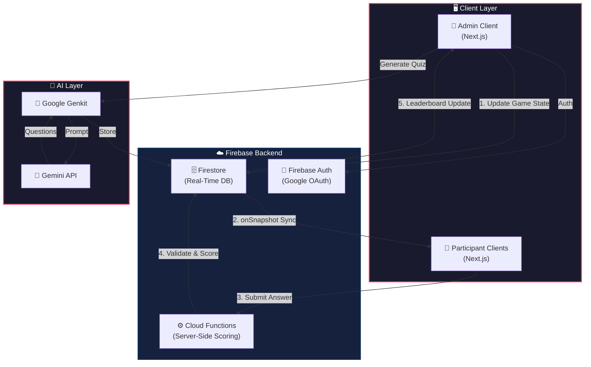

<div align="center">

```
╔══════════════════════════════════════════════════════════════════╗
║                                                                  ║
║      ██████╗ ██╗   ██╗██╗███████╗██╗    ██╗██╗  ██╗██╗███████╗  ║
║     ██╔═══██╗██║   ██║██║╚══███╔╝██║    ██║██║  ██║██║╚══███╔╝  ║
║     ██║   ██║██║   ██║██║  ███╔╝ ██║ █╗ ██║███████║██║  ███╔╝   ║
║     ██║▄▄ ██║██║   ██║██║ ███╔╝  ██║███╗██║██╔══██║██║ ███╔╝    ║
║     ╚██████╔╝╚██████╔╝██║███████╗╚███╔███╔╝██║  ██║██║███████╗  ║
║      ╚══▀▀═╝  ╚═════╝ ╚═╝╚══════╝ ╚══╝╚══╝ ╚═╝  ╚═╝╚═╝╚══════╝  ║
║                                                                  ║
║           ⚡ Real-Time AI-Powered Quiz Platform ⚡               ║
║                                                                  ║
╚══════════════════════════════════════════════════════════════════╝
```

[](https://nextjs.org/)
[](https://react.dev/)
[](https://www.typescriptlang.org/)
[](https://firebase.google.com/)
[](https://tailwindcss.com/)
[](https://ai.google.dev/)

---

**QuizWhiz** is a real-time, serverless quiz platform designed for interactive events and classroom assessments.  
Create custom quizzes, manage live sessions, and synchronize game state across hundreds of devices —  
all with AI-powered question generation and zero participant sign-ups.

</div>

---

## 📋 Table of Contents

```
┌──────────────────────────────────────────┐
│                                          │
│   01. ❓  Problem Statement              │
│   02. ✨  Key Features                   │
│   03. 🛠️  Tech Stack                     │
│   04. 🏗️  System Architecture            │
│   05. 📂  Project Structure              │
│   06. 🚀  Getting Started                │
│   07. ☁️  Deployment                     │
│   08. 🤝  Contributing                   │
│   09. 👥  Contributors                   │
│                                          │
└──────────────────────────────────────────┘
```

---

## ❓ Problem Statement

```
┌─────────────────────────────────────────────────────────────────────────┐
│                                                                         │
│  Organizing live quizzes for university clubs, tech events, or large    │
│  gatherings often involves either:                                      │
│                                                                         │
│     ❌  Manual scoring  →  Slow and error-prone                         │
│     ❌  Enterprise software  →  Expensive and complex                   │
│                                                                         │
│  QuizWhiz solves this by providing a lightweight, scalable solution     │
│  with real-time state sync and automated scoring — no participant       │
│  registration required.                                                 │
│                                                                         │
└─────────────────────────────────────────────────────────────────────────┘
```

---

## ✨ Key Features

```
┌──────────────────────────────┐  ┌──────────────────────────────┐
│  🤖 AI Quiz Generation      │  │  ⚡ Real-Time Sync           │
│                              │  │                              │
│  Generate questions via      │  │  Game state updates on all   │
│  Google Gemini models        │  │  devices via Firestore       │
│  through Genkit instantly.   │  │  listeners instantly.        │
└──────────────────────────────┘  └──────────────────────────────┘

┌──────────────────────────────┐  ┌──────────────────────────────┐
│  🔒 Server-Side Scoring     │  │  🎨 Cyberpunk UI             │
│                              │  │                              │
│  Secure scoring via Cloud    │  │  Stunning neon interface     │
│  Functions prevents any      │  │  with sharp edges, parallax  │
│  client-side cheating.       │  │  effects & animations.       │
└──────────────────────────────┘  └──────────────────────────────┘

┌──────────────────────────────┐  ┌──────────────────────────────┐
│  🛡️ Admin Dashboard          │  │  🏆 Dynamic Leaderboard      │
│                              │  │                              │
│  Create quizzes, manage      │  │  Real-time ranking of top    │
│  content, and control live   │  │  performers updated after    │
│  game flow seamlessly.       │  │  every round.                │
└──────────────────────────────┘  └──────────────────────────────┘

┌──────────────────────────────┐  ┌──────────────────────────────┐
│  🎮 Live Session Control     │  │  🔐 Secure Access            │
│                              │  │                              │
│  Start questions, reveal     │  │  Route protection & role-    │
│  answers, and advance        │  │  based access control for    │
│  rounds manually.            │  │  admin functions.            │
└──────────────────────────────┘  └──────────────────────────────┘
```

---

## 🛠️ Tech Stack

| Layer | Technology | Purpose |
|:---:|:---|:---|
| **Frontend** | Next.js 16 (App Router), React 19, TypeScript | UI framework & rendering |
| **Styling** | Tailwind CSS, Radix UI (Cyberpunk Design System) | Design system & components |
| **AI** | Google Genkit, Gemini API | AI-powered quiz generation |
| **Database** | Firebase Firestore (NoSQL) | Real-time data & state sync |
| **Functions** | Firebase Cloud Functions (Node.js 20) | Server-side scoring logic |
| **Auth** | Firebase Authentication (Google OAuth) | Admin identity management |
| **Hosting** | Vercel (Frontend), Google Cloud Platform (Backend) | Deployment infrastructure |

---

## 🏗️ System Architecture



### Data Flow

```
┌─────────────────────────────────────────────────────────────────────┐
│                        REAL-TIME GAME LOOP                          │
│                                                                     │
│   ┌─────────┐    ┌───────────┐    ┌───────────┐    ┌────────────┐  │
│   │  LOBBY  │───▶│ QUESTION  │───▶│  ANSWER   │───▶│ LEADERBOARD│  │
│   │  PHASE  │    │  START    │    │ SUBMISSION │    │  UPDATE    │  │
│   └─────────┘    └───────────┘    └───────────┘    └────────────┘  │
│       │               │               │                  │         │
│       ▼               ▼               ▼                  ▼         │
│   Admin sets     Admin updates   Participant      Scores sorted    │
│   status to      question index  submits via      & displayed      │
│   'lobby'        & start time    Cloud Function   in real-time     │
│                                                                     │
└─────────────────────────────────────────────────────────────────────┘
```

### Firestore Data Model

```
📦 quizzes/ (Collection)
 ┣ 📄 {quizId} (Document)
 ┃  ┣ 📝 title: string
 ┃  ┣ 📝 status: 'draft' | 'lobby' | 'active' | 'ended'
 ┃  ┣ 📝 currentQuestionIndex: number
 ┃  ┣ 📝 questionStartTime: timestamp
 ┃  ┃
 ┃  ┣ 📦 questions/ (Subcollection)
 ┃  ┃  ┗ 📄 {questionId}
 ┃  ┃     ┣ 📝 questionText: string
 ┃  ┃     ┣ 📝 options: string[]
 ┃  ┃     ┣ 📝 correctOptionIndex: number
 ┃  ┃     ┗ 📝 timeLimit: number
 ┃  ┃
 ┃  ┗ 📦 participants/ (Subcollection)
 ┃     ┗ 📄 {participantId}
 ┃        ┣ 📝 name: string
 ┃        ┣ 📝 totalScore: number
 ┃        ┗ 📝 answers: Array<{ questionId, selectedOptionIndex, pointsEarned }>
```

---

## 📂 Project Structure

```
QuizWhiz/
├── src/
│   ├── app/
│   │   ├── admin/          # 🛡️  Admin dashboard (protected)
│   │   ├── join/           # 🎮  Participant entry point
│   │   └── play/[quizId]/  # ⚡  Live game loop
│   ├── ai/                 # 🤖  Genkit flows & Gemini config
│   ├── components/         # 🧩  Reusable UI components
│   └── lib/
│       └── firebase-service.ts  # 🔥 Firestore abstraction layer
├── functions/              # ☁️  Firebase Cloud Functions
├── firestore.rules         # 🔒  Database security rules
├── public/                 # 📁  Static assets
└── package.json
```

---

## 🚀 Getting Started

### Prerequisites

```
┌──────────────────────────────────────────┐
│  ✅  Node.js 18+                         │
│  ✅  Firebase Project (Firestore + Auth) │
│  ✅  Google Gemini API Key               │
└──────────────────────────────────────────┘
```

### Installation

```bash
# 1. Clone the repository
git clone https://github.com/prem22k/QuizWhiz.git
cd QuizWhiz

# 2. Install dependencies
npm install

# 3. Configure environment
cp .env.example .env.local
```

### Environment Variables

Create a `.env.local` file:

```env
NEXT_PUBLIC_FIREBASE_API_KEY=your_api_key
NEXT_PUBLIC_FIREBASE_AUTH_DOMAIN=your_project_id.firebaseapp.com
NEXT_PUBLIC_FIREBASE_PROJECT_ID=your_project_id
GOOGLE_GENAI_API_KEY=your_gemini_api_key
```

### Run Locally

```bash
npm run dev
```

> App will be available at **`http://localhost:3000`**

---

## ☁️ Deployment

### Frontend — Vercel

```
┌─────────────────────────────────────────────┐
│  1. Connect GitHub repo to Vercel           │
│  2. Add .env.local vars to Vercel settings  │
│  3. Deploy 🚀                               │
└─────────────────────────────────────────────┘
```

### Backend — Firebase

```
┌─────────────────────────────────────────────────────────────┐
│  1. Deploy Firestore security rules                         │
│  2. Add production domain to Firebase Auth authorized list   │
│  3. Deploy Cloud Functions                                   │
└─────────────────────────────────────────────────────────────┘
```

---

## 🤝 Contributing

```
┌──────────────────────────────────────────────────────┐
│                                                      │
│   1.  🍴  Fork the repository                        │
│   2.  🌿  Create a feature branch                    │
│       git checkout -b feature/amazing-feature        │
│   3.  💾  Commit your changes                        │
│       git commit -m 'Add amazing feature'            │
│   4.  📤  Push to the branch                         │
│       git push origin feature/amazing-feature        │
│   5.  🔀  Open a Pull Request                        │
│                                                      │
│   Please ensure all code is properly typed with      │
│   TypeScript and includes relevant error handling.   │
│                                                      │
└──────────────────────────────────────────────────────┘
```

---

## 👥 Contributors

<div align="center">

```
╔══════════════════════════════════════════════════════════════════════════╗
║                          MEET THE TEAM                                  ║
╚══════════════════════════════════════════════════════════════════════════╝
```

<table>
  <tr>
    <td align="center" width="300">
      <a href="https://github.com/ChitkulLakshya">
        
        <br />
        <b>Lakshya Chitkul</b>
      </a>
      <br />
      <sub>Project Lead · Core Architecture</sub>
      <br /><br />
      <a href="https://github.com/ChitkulLakshya">
        
      </a>
    </td>
    <td align="center" width="300">
      <a href="https://github.com/prem22k">
        
        <br />
        <b>Prem Sai Kota</b>
      </a>
      <br />
      <sub>AI Generation · Auth · Deployment</sub>
      <br /><br />
      <a href="https://github.com/prem22k">
        
      </a>
    </td>
    <td align="center" width="300">
      <a href="https://github.com/eesha264">
        
        <br />
        <b>Eeshitha Gone</b>
      </a>
      <br />
      <sub>UI/UX Design · Animations</sub>
      <br /><br />
      <a href="https://github.com/eesha264">
        
      </a>
    </td>
  </tr>
</table>

</div>

---

<div align="center">

```
╔══════════════════════════════════════════════════════════════════╗
║                                                                  ║
║          Built with ❤️ using Next.js, Firebase & Gemini          ║
║                                                                  ║
╚══════════════════════════════════════════════════════════════════╝
```

</div>
